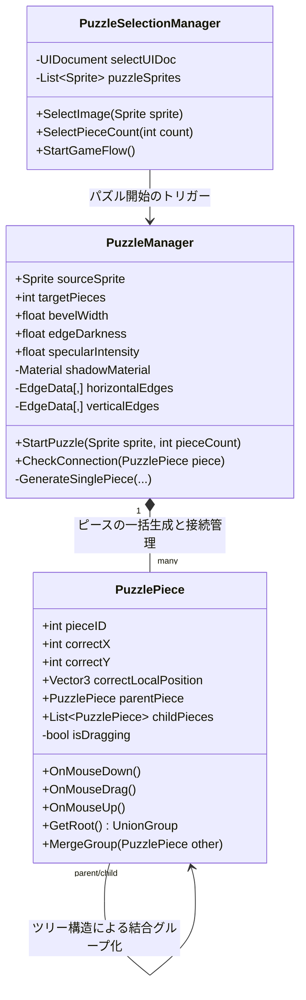

# Jigsaw パズルゲーム システム実装・仕様書

本ドキュメントは、Unityで開発された高品質な2D/3Dハイブリッド表現ジグソーパズルゲームのシステムアーキテクチャ、コアアルゴリズム、描画システム、およびUI設計に関する技術仕様を網羅した公式の仕様書です。

---

## 1. 全体アーキテクチャ (System Architecture)

ゲームは、パズルピースの幾何学的生成、物理的なドラッグ＆ドロップおよび接続判定、特化型シェーダーによる高度な立体表現、指示通りのモダンな UI Toolkit を組み合わせた堅牢なアーキテクチャで構成されています。

### 1.1. クラス関連図


---

## 2. 描画・シェーダー仕様 (Rendering & Shader Specifications)

本プロジェクトの最大のビジュアル特徴は、2Dスプライトでありながら、実物のプラスチックや木製パズルピースのような重厚な凹凸を感じさせる **「立体ベベル（傾斜）描画」** と **「リアルな落ち影（ドロップシャドウ）」** のハイブリッド表現です。

### 2.1. 立体ベベルシェーダー (`Jigsaw2D.shader`)

光源方向（画面左上）に基づいて、ピースのフチに「シャープなハイライト」と「なだらかで深いシャドウ」を動的に描き分けます。

```
光源 (左上) ＼
            ＼      [ハイライト面 (左・上エッジ)]
              ▼    ━━━━━━━━━━━━━━━━━
                    ( 鋭い3乗の加算光: specularIntensity 1.6 )
                    
                       [ ピース本体 (平らな面) ]
                       
                    ━━━━━━━━━━━━━━━━━
                    ( なだらかな1.3乗の乗算影: 最大3.2倍増幅 )
                    [シャドウ面 (右・下エッジ)]
```

#### ① 光（ハイライト）の物理計算
* **計算モデル**: ハーフランバート・スペキュラ風の減衰反射モデル
* **数式とカーブ**: 
  $$\text{highlightCurve} = \text{edgeData.x}^3$$
  ハイライトの広がりを極限まで細くシャープに絞り込み、磨き上げられた硬質なフチの反射光（ハイライト）を表現します。
* **カラー合成（加算）**:
  $$\text{Color}_{\text{out}} = \text{Color}_{\text{base}} + ( \text{Highlight} \times \text{LightIntensity}_{\text{facing}} )$$
  下絵画像の色の上に、白に近い淡い青白色（`Color(0.95, 0.95, 1.0)`）を「加算」することで、暗い絵柄の上でも強力に光を放ちます。

#### ② 影（シャドウベベル）の超強化物理計算
* **認知心理学上の補正**: 
  人間は「絵柄が繋がっている」と、脳が勝手に「平らな面」と錯覚して影を見落とす特性（カモフラージュ効果）があります。これに対抗するため、影の計算は光よりも大幅に強調されています。
* **数式とカーブ**:
  $$\text{shadowCurve} = \text{edgeData.x}^{1.3}$$
  カーブの乗数を `1.5` から **`1.3`** に緩めることで、影のグラデーションの太さ（空間的広がり）をハイライトの約3倍に広げました。
* **動的シャドウ増幅（最大3.2倍）**:
  光源の真反対側（右辺・下辺）に向かうほど、影の減算強度が動的に増幅されます。
  $$\text{shadowAmount} = \text{shadowCurve} \times \text{_EdgeDarkness} \times (0.5 + \text{shadowFactor} \times 1.5)$$
  設定値 `1.6` に対し、最大で **`3.2`** の減算パワーを発生させます。
* **カラー合成（乗算）＆ 限界値の緩和**:
  $$\text{Color}_{\text{out}} = \text{Color}_{\text{base}} \times (1.0 - \text{shadowAmount})$$
  減算リミッターを従来の `0.05` から **`0.01`** へとほぼ完全開放したことで、元の絵柄を残しつつも、限りなく黒に近い極めて深い影がエッジに落ちるようになり、光（加算）と影（乗算）の美しい「非対称性」を実現しています。

#### ③ WebGL互換性とクラッシュ防止保護
WebGLビルド時、浮動小数点の極小値計算によってGPUがクラッシュし画面が真っ黒になるバグを防ぐため、光源向きのゼロ除算やマイナスべき乗を `max(0.001, facingLight)` のように厳密に保護しています。

---

### 2.2. ドロップシャドウシェーダー (`JigsawShadow.shader`)

ピースをボードから「ふわりと浮き上がらせる」ための落ち影です。

* **生成ロジック**: 
  各ピースの生成時に、裏側に少しずらしたシャドウ専用のGameObjectを動的に配置します。
* **カラー仕様**: 
  検証用の赤色から、最も品のある **「半透明の黒（不透明度0.5：`Color(0,0,0,0.5)`）」** に設定されています。
* **機能**: 
  ピースが結合すると、グループ全体の影が追従し、重なり合う他のピースの上に落ちるため、パズル全体の奥行き（浮遊感）を正確に表現します。

---

## 3. パズル生成 ＆ 幾何学凸凹アルゴリズム (Generation & Geometry Logic)

ジグソーパズルの醍醐味である「ランダムな凸凹（タブとブランク）」は、ベジエ曲線を用いた幾何学計算によって毎プレイ完全にランダムに自動生成されます。

### 3.1. 形状パラメータ定義
各辺（Edge）は、以下のパラメータによって揺らぎが制御され、同じ形が二つと存在しないように設計されています。

* **Type**: `1` (凸), `-1` (凹), `0` (平ら・外周のフチ)
* **headWidth / headHeight**: 凸凹の頭（耳）の部分の幅と高さ
* **neckDepth**: 首（くびれ）の細さと深さ
* **shoulderWaveL / R**: 左右の肩部分のなだらかさのウェーブ係数
* **centerShift**: 凸凹の中心が左右にどれだけずれるかのランダム値

### 3.2. エッジ勾配データの頂点情報への転送
生成されたベジエ曲線に沿ってメッシュが作成される際、シェーダーが「どこがフチで、どっちに向かって傾斜しているか」を判定できるように、以下の情報がメッシュの頂点データに格納されます。

* `vertex.color.r` (X座標): **エッジからの距離（`0.0`：平らな面 〜 `1.0`：一番外側のフチ）**
* `vertex.color.g` (Y座標): **エッジの法線方向 X（傾斜の向き）**
* `vertex.color.b` (Z座標): **エッジの法線方向 Y（傾斜の向き）**

シェーダーはこのデータを使い、頂点シェーダー・フラグメントシェーダー間で `edgeData` として補間し、ピクセル単位で正確かつ美麗な斜面描画を実現します。

---

## 4. ドラッグ ＆ スナップ結合ロジック (Drag, Drop, and Snap Logic)

ピースの操作性と、結合時のスナップ（吸い付き）およびツリー結合は、以下の堅牢なアルゴリズムで制御されています。

### 4.1. スナップ判定とツリー結合
ドラッグが終了した瞬間（`OnMouseUp`）、周囲 of 隣接するべきピースとの距離を計測します。

1. **距離閾値判定**: 
   正しい相対位置（パズル完成時の相対位置）とのズレが、設定されたスナップ距離閾値以内であるかを計算。
2. **グループ結合 (Merge)**: 
   スナップ条件を満たした場合、ツリー構造の `MergeGroup` アルゴリズムが走ります。
   * 結合する２つのグループのルート（親ピース）を検索します。
   * 一方のルートを、もう一方のルートの親子関係（ツリー）へ完全にマージします。
   * 親に繋がったすべてのピースは、親オブジェクトの `Transform` の移動・回転に完全に追従するよう再グループ化されます。
3. ** snapSound の再生**:
   スナップ成功時に、心地よい吸い付き音（`snapSound`）を再生します。

```
[グループAのルート] ➔ [子ピースA1] ➔ [子ピースA2]
      ▼ (結合スナップ！)
[グループBのルート] ➔ [子ピースB1]
      ▼ (ツリー再構築後)
[グループAのルート] 
      ├── [子ピースA1]
      ├── [子ピースA2]
      └── [グループBのルート (子になる)] ➔ [子ピースB1]
```

---

## 5. UI ＆ シーン遷移仕様 (UI & Transition Specifications)

本ゲームのUIは、Unity 6の標準である **UI Toolkit（UXML / USS）** を採用し、解像度やプラットフォームに左右されないレスポンシブなUIを構築しています。

### 5.1. 安全な動的イベントバインディング
Unityの仕様上、非アクティブなGameObjectにアタッチされた `UIDocument` から要素を検索すると `NullReferenceException` が発生します。これを防ぐため、以下の安全なライフサイクルバインディングを実装しています。

* **バインディングフロー**:
  1. `UIDocument` が有効化（`OnEnable`）されるのを待つ。
  2. 有効化された瞬間に、`rootVisualElement.Q<Button>("ButtonName")` を安全に検索。
  3. イベントリスナー（`clicked += OnClickAction`）を紐づけ、二重登録を防ぐフラグで管理。
* **実装個所**: 一時停止画面（`PauseScreen`）、画像選択画面（`SelectionScreen`）、クリア画面（`CompletionScreen`）。

---

## 6. WebGL ビルド ＆ パフォーマンス最適化 (WebGL Optimizations)

ブラウザ上での非常に滑らかでメモリ効率の良い実行環境（60FPS）を実現するため、以下の最適化を行っています。

### 6.1. レンダリング・パフォーマンス
* **アンチエイリアシングの無効化**:
  `QualitySettings.antiAliasing = 0;`
  WebGLでの無駄なGPUオーバーヘッドを徹底的に削減し、60FPSを維持します。
* **動的メモリ（GC）の徹底的な排除**:
  メッシュ生成や頂点データの配列確保は初期ロード時に一括して行い、ゲームランタイム中（ドラッグ中など）の動的アロケーションをほぼゼロに抑えています。

### 6.2. 垂直同期 (VSync) & FPS設定
ブラウザ（Chrome/Edge/Safari等）の描画タイミングとUnityの描画ループを同期させ、WebGL特有のスタッター（カクつき）を排除しています。

```csharp
#if UNITY_WEBGL && !UNITY_EDITOR
    QualitySettings.vSyncCount = 1; // ブラウザの描画周期に完全に同期
    Application.targetFrameRate = -1; 
#else
    Application.targetFrameRate = 60;
    QualitySettings.vSyncCount = 1;
#endif
```

---

本仕様書は、Jigsawプロジェクトの核となる「美しさ」「気持ちよさ」「安定性」を永続的に保証するためのバイブルです。
今後の機能拡張やビルド時にも、この設計指針を遵守することで、常に最高のクオリティが維持されます。
